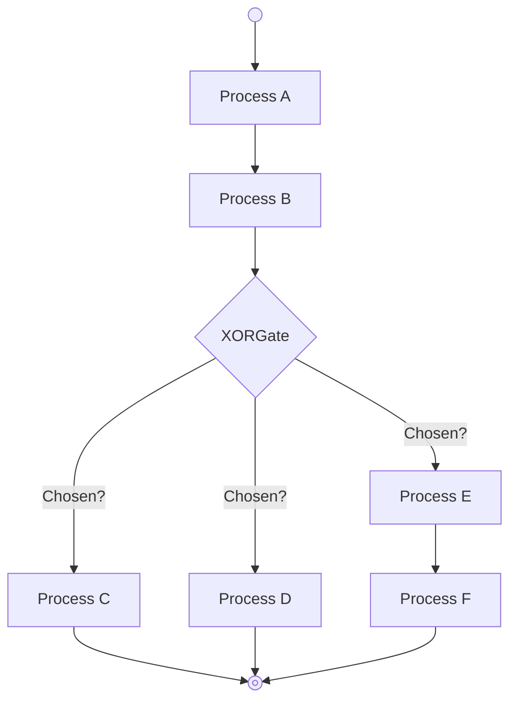
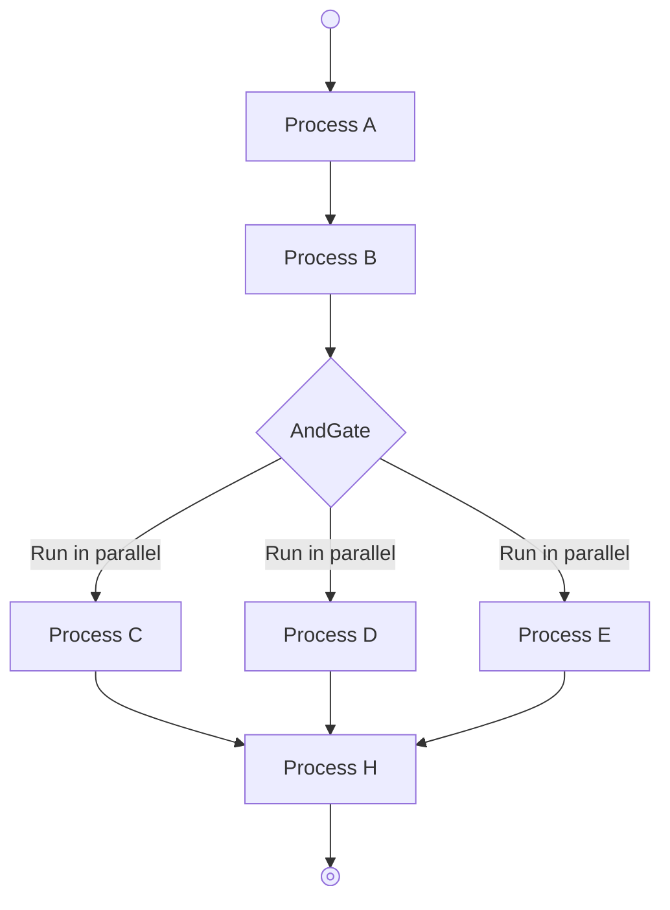

# Flows
A lightweight, BPMN-inspired workflow engine for PHP 8.1+.

Flows lets you build resumable, observable workflows with branching logic, savepoints, and undo - all in plain PHP with few external dependencies.

Use for multi-step forms, sagas, wizards, or any long-running business process.
## Requirements
- PHP 8.1+
# Current features:
Flows PHP library can be used as a standalone tool to create your own application or in conjunction with your favorite PHP framework as an embeddable library.
- [Abstract/Concrete object factory](#abstract-and-concrete-object-factory)
- [Configurable](#configurable)
- [Event handling](#event-handling)
- [Facades](#facades)
- [Gate, process and task observability](#gate-process-and-task-observability)
- [Process offloading](#process-offloading)
- [React to external events](#react-to-external-events)
- [Save/Undo process states](#saveundo-process-state)
- [Service container](#service-container)
## Planned features:
- [Process serialization (planned, WIP)](#process-serialization-wip)
- HTTP message gate events (planned, WIP)
## Live Demo
See it in action right now:  
https://github.com/sousarmb/flows-example-app  
Clone and run the demos, they use the current [main](https://github.com/sousarmb/flows/blob/main/README.md) version of Flows.
### Quick Start (5 minutes)
```bash
git clone https://github.com/sousarmb/flows-example-app.git flows-demo 
cd flows-demo 
docker-compose up -d 
docker exec -ti flows-example-app bash
```
Install dependencies with:
```bash
composer install
```
Run the process branching with XOR gate demo with:
```bash
php App/demo-branch-xor-gate.php
```
Try the other demos in the [`App`](https://github.com/sousarmb/flows-example-app/tree/main/App) directory.
# Installation
This package can be installed as a [Composer](https://getcomposer.org/) dependency with:
```bash
composer require rsousa/flows
```
After installation use the `flows help` command to get help on how to create the components needed to create your workflows:
```bash
vendor/bin/flows help
```
Then start with:
```bash
vendor/bin/flows create:scaffold
```
To create the necessary directories and files to write your application.
# How it works
The building blocks of flows are tasks, processes and gates.

Application code is written inside tasks. Tasks receive input from the previous task and return output to be used as the next task input or process start.

Tasks are executed sequencially in a process.

Processes group tasks and act as pipelines, controlling task input and output, handing over control to the application kernel when it's time to branch to another process.

Branching is controlled by the application kernel.

When the developer needs to branch to another process it places a gate in the process.

Gates have access to task output and the developer may use it to write logic to select where to branch next, creating the workflow.

Branch exclusively or in parallel. Parallel branches always return to the process where they branched. Exclusive branches do not, they may go a different flow.

Once the workflow ends (no more branching occurs), process output is returned to the calling code (when running as embeddable library) or the application exits.

## Workflow Example
### XOR Gate

### And Gate

# First Project
1. Plan your tasks and group them into processes
2. Create task class(es) (as many as needed) with:
```bash
vendor/bin/flows create:task name=[task-class-name]
```
3. Create input/output class(es) for your tasks with:
```bash
vendor/bin/flows create:io name=[io-class-name]
```
3. Create process class(es) to group the tasks with:
```bash
vendor/bin/flows create:process name=[process-class-name]
```
4. Create gate class(es) to branch processes with:
```bash
vendor/bin/flows create:gate name=[gate-class-name]
```
5. Create a PHP script in the `App` directory:
```bash
touch App/[workflow-class-name].php
```
6. Edit the script to create the workflow:
```code
<?php

declare(strict_types=1);

namespace App;

use App\Processes\[process_A];
use App\Processes\[process_B];
use App\Processes\[process_C];
use Flows\ApplicationKernel;
use Flows\Registries\ProcessRegistry;

require __DIR__ . '/../vendor/autoload.php';

$app = new ApplicationKernel();
// Register the processes your workflow uses
$app->setProcessRegistry(
        (new ProcessRegistry())
                ->add([process_A]::class)
                ->add([process_B]::class)
                ->add([process_C]::class)
);
// Run the first process in the workflow
$return = $app->process([process_A]::class, null);
// Do whatever you need with the return (... probably some task already took care of that)
```
7. Edit the process class(es)
```code
<?php

declare(strict_types=1);

namespace App\Processes;

use App\Processes\IO\[io_class_A];
use App\Processes\Tasks\[task_class_A];
use Collectibles\Contracts\IO as IOContract;
use Collectibles\IO;
use Flows\Contracts\Tasks\Task as TaskContract;
use Flows\Gates\[gate_class_A];
use Flows\Processes\Process;

class [process_class_A] extends Process
{
    public function __construct()
    {
        // Register tasks using the $tasks array. These will run sequencially
        $this->tasks = [
            // You can set your tasks like this
            [task_class_A]::class,
            // Or define an anonymous class that implements the Task contract
            new class implements TaskContract {
                public function __invoke(?IOContract $io = null): ?IOContract
                {
                    // Use anonymous classes as intented
                    return new readonly class(1) extends IO {
                        public function __construct(protected int $counter) {}
                    };
                }
                // Clean up runs after the process is done
                public function cleanUp(bool $forSerialization = false): void {}
            },
            new class implements TaskContract {
                public function __invoke(?IOContract $io = null): ?IOContract
                {
                    return new [io_class_A]($io->get('counter') + 1);
                }

                public function cleanUp(bool $forSerialization = false): void {}
            },
            // The same goes for gates (branching): use anonymous class or the class name string
            new class extends OffloadAndGate {
                public function __invoke(): array
                {
                    // These are the processes to branch
                    return [
                        [parallel_process_A]::class,
                        [parallel_process_B]::class,
                        [parallel_process_C]::class
                    ];
                }
                // Even gates have clean up
                public function cleanUp(bool $forSerialization = false): void {}
            },
            // Return to the "main" branch
            // This final task use output from the previous tasks, which has been collected into one output collection, grouped by class name
            new class implements TaskContract {
                public function __invoke(?IOContract $io = null): ?IOContract
                {
                    $pid = ['parent#PID' => getmypid()];
                    $pid[[parallel_process_A]::class . '#PID'] = $io->get([parallel_process_A]::class)->get('pid');
                    $pid[[parallel_process_B]::class . '#PID'] = $io->get([parallel_process_B]::class)->get('pid');
                    $pid[[parallel_process_C]::class . '#PID'] = $io->get([parallel_process_C]::class)->get('pid');
                    $total = $io->get([parallel_process_A]::class)->get('counter')
                        + $io->get([parallel_process_B]::class)->get('counter')
                        + $io->get([parallel_process_C]::class)->get('counter');
                    // Output class(es) can be anonymous as well
                    return new readonly class($total, $pid) extends IO {
                        public function __construct(
                            protected int $counter,
                            protected array $pid
                        ) {}
                    };
                }

                public function cleanUp(bool $forSerialization = false): void {}
            },
        ];
        // Do task validation and setup
        parent::__construct();
    }
}
```
8. Add your business logic to the task classes
```code
<?php

declare(strict_types=1);

namespace App\Processes\Tasks;

use App\Processes\IO\[io_class_A];
use Collectibles\Contracts\IO as IOContract;
use Flows\Contracts\Tasks\Task as TaskContract;

class [task_class_A] implements TaskContract
{
    // Input and output passing is managed by the library
    public function __invoke(?IOContract $io = null): ?IOContract
    {
        return new [io_class_A](
            getmypid(),
            $io->get('counter') + 1,
        );
    }

    public function cleanUp(bool $forSerialization = false): void {}
}
```
That's mostly it!
> Previous task output is available inside gate classes through the protected class member `$io`. Use it if needed to determine which way to branch the workflow.

> [`IO`](https://github.com/sousarmb/collectibles/blob/main/src/IO.php) class instances act as data transfer objects, **they are readonly by design**. If you need to use the same `IO` class instance across tasks but use it as a CRUD, use [`Collection`](https://github.com/sousarmb/collectibles/blob/main/src/Collection.php) class instances instead.

## Remember...
Your task, process, IO and gate class instances are [PHP classes](https://www.php.net/manual/en/language.oop5.php), totally under your control. Add methods and/or import other classes, traits as needed. Your approach rules!
## Features explained
### Abstract and concrete object factory
The factory creates objects using reflection. If other concrete classes are type hinted in the class constructor, they are injected into the new object. The factory can also retrieve dependencies from the service container.

For [abstract type hints (interfaces)](https://github.com/sousarmb/flows-example-app/blob/main/App/Config/service-provider.php), you can register service provider classes. These are used by the container to determine the correct concrete dependency/class the factory injects into the new object.
### Configurable
The following files control aspects of the application:
- `app.php` holds flags and variables available to you, accessible through the `Config` facade.
- `event-handler.php` maps event to handler classes.
- `service-provider.php` maps interfaces to services provider classes. Can also hold concrete class names. Use for dependency injection in tasks.
- `subject-observer.php` maps subject to observer classes.

These files can be found in the `App\Config` directory. 
### Event handling
Events are fired inside tasks using the `Events` facade, that hands them to their handler. Events can be handled:
- realtime, handled in place
- deferred:
    - from process, handled when the process branches/ends
    - from flow, handled when the flow is done (no more branches)

Set this behaviour using attributes available in the `Flows\Attributes` namespace.
### Facades
Access flows features using the available facades:
- `Config` access to settings from the `app.php` configuration file.
- `Container` access to the service container.
- `Events` access to the events kernel, use to fire events.
- `Logger` use to log events in the application log
- `Observers` access to the observers kernel, use to manually register subjects and observer classes,  trigger observation.

Facades are available in the `Flows\Facades` namespace and allow access to the actual services, not proxies. The actual services can also be type hinted in the process/task constructors.
### Gate, process and task observability
Gates, processes and tasks are observed automatically (no need to write code for this) when registered in the `subject-observer.php` configuration file.

Observations can happen:
- **Realtime**, handled in place
- **Deferred**:
    - From **process**, handled when the process branches/ends
    - From **flow**, handled when the flow is done (no more branches)

Set this behaviour using attributes available in the `Flows\Attributes` namespace.
### Process offloading
If you need to run application workflows in separate PHP processes (different #PID) use an [offload gate](https://github.com/sousarmb/flows-example-app/blob/main/App/Processes/Gates/LetsGoOffloadGate.php). The application kernel will handle new process creation and communication with the "parent" process using a reactor. 

The "parent" process is paused while waiting for the "child" processes to complete. The new "child" processes receive the same input (output from the last task in the "parent" process) and are not synchronized with each other. 

When the child process complete, their output is collected and the parent process is given it, to pass resume and pass it to the next task.
### Process serialization (WIP)
Process and task classes implement `__sleep()` and `__wakeup()` to allow serialization. In theory a workflow can be "frozen" in time to be stored in a database, reloaded and resumed at any later time. Work in progress.
### React to external events
One of your processes needs an external action to complete: a record written in a database table, a mail to arrive, a filesystem file updated, etc. 

If your business logic requires a process to wait until some condition happens, you can write an event gate to handle this case.

Event gates [group conditions](https://github.com/sousarmb/flows-example-app/blob/main/App/Processes/Gates/WaitForFileModificationGate.php) that need to happen for a process to resume. The gate waits for one of multiple external conditions to resolve first (`$winner` member), then branchs accordingly. 

You write the gate event classes.

A wait timeout (`$expires` member) for the gate is always set. If no event resolves during this timeout, a default branch must be selected. Think of it as a switch default.
### Save/Undo process state
Sometimes things go wrong. If this happens it's possible to return the current process to a previous state and resume from there.

 How? Place process savepoints (`Flows\Processes\Sign\SaveState` class) between tasks and then [write undo state gates](https://github.com/sousarmb/flows-example-app/blob/main/App/Processes/StateChangeWithSaveAndUndoProcess.php) to evaluate if the process needs to go back to a previous state and resume from there.
### Service container
The service container stores objects that can be injected by the factory when creating class instances, as object dependencies.

You can control how services are managed in the container using the **Lazy** and **Singleton** attributes.
#### Lazy
Services are instantiated [only when needed](https://github.com/sousarmb/flows-example-app/blob/main/App/Services/DateService.php).
#### Singleton
Class is instantiated [only once](https://github.com/sousarmb/flows-example-app/blob/main/App/Services/DateService.php). When type-hinted for injection or retrieved from the container, the same instance is returned every time.
# Documentation
For now, explore:
- The example app
- Source code in `src/` (heavily commented)
- The core Process class: https://github.com/sousarmb/flows/blob/dev/src/Processes/Process.php
## Status
Early development (work in progress). The core is stable and usable. Some planned features are not ready yet.
# That's it
Flows is still young. The core engine works well today, and the example app proves it.

Feedback, issues, and PRs are very welcome! If something is confusing or missing, open an issue - I'll fix it fast.

Happy flowing!